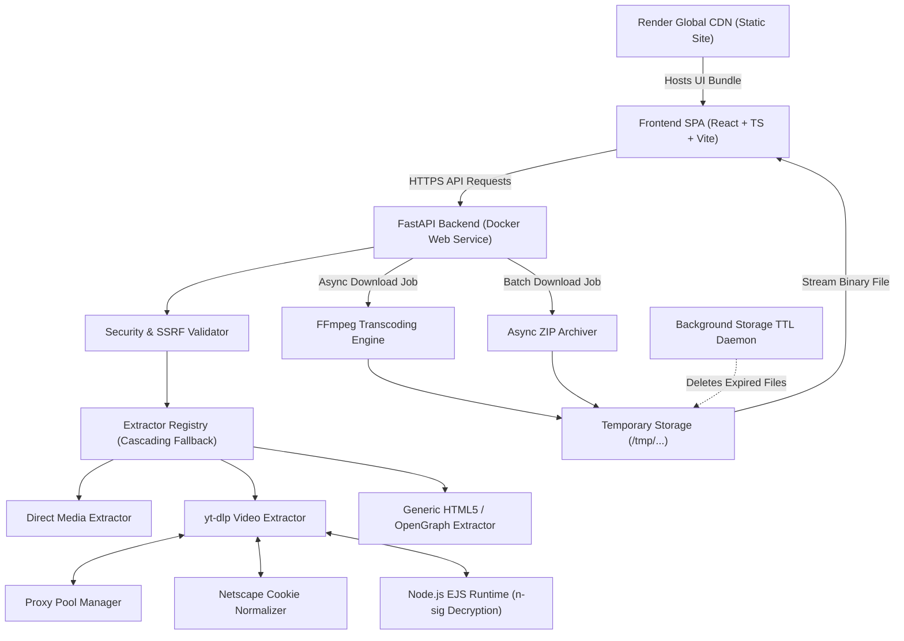

# DownFromNet — System Architecture & Technical Documentation

---

## 1. Executive Summary

**DownFromNet** is a modern, modular, production-grade universal media extraction and downloading engine. It allows users to inspect, preview, transcode, and download publicly accessible media (video streams, audio tracks, standalone media files, and image galleries) from platforms across the internet (YouTube, Instagram, TikTok, Facebook, Twitter/X, Reddit, Vimeo, SoundCloud, and generic web pages).

### Core Problem Solved
Traditional media download utilities suffer from:
- **Cloud IP Restrictions:** Social media platforms (such as YouTube) aggressive bot-blocking on datacenter IP addresses (AWS, GCP, Render).
- **Fragile Single-Strategy Scrapers:** Failure when a platform changes its DOM or stream manifest structure.
- **Security Vulnerabilities:** Server-Side Request Forgery (SSRF), shell injection, and path traversal vulnerabilities.
- **Resource Bloat:** High server memory consumption and storage leaks from abandoned temporary downloads.

**DownFromNet resolves these challenges** through multi-tier fallback extractors, dynamic residential proxy pool rotation, Node.js external JS challenge solving, strict SSRF IP filters, in-memory job queues, and automated background TTL storage cleanup.

---

## 2. Architecture & Request Pipeline

### 2.1 End-to-End Architecture Diagram



---

## 3. Core Subsystems

### 3.1 Security & SSRF Engine (`app/core/security.py`)
To prevent internal network exploration or cloud metadata attacks:
- **DNS & IP Validation**: Resolves candidate hostnames and checks against IPv4 and IPv6 private/reserved ranges before making network requests.
- **Blocked Subnets**:
  - `127.0.0.0/8` (Loopback)
  - `10.0.0.0/8`, `172.16.0.0/12`, `192.168.0.0/16` (Private RFC1918)
  - `169.254.0.0/16` (Link-Local & Cloud Instance Metadata e.g. AWS/GCP `169.254.169.254`)
  - `::1`, `fc00::/7`, `fe80::/10` (IPv6 loopback/link-local)
- **Sanitized Filenames**: Strips control characters, non-alphanumeric separators, and directory separators (`../`) to prevent path traversal.

### 3.2 Cascading Extractor Registry (`app/extractors/`)
When a URL is submitted, DownFromNet routes the request through a priority chain:

1. **Direct Media Extractor (`direct.py`)**:
   - Performs lightweight `HEAD` requests to inspect `Content-Type` headers for direct video/audio/image formats (`video/mp4`, `image/webp`, `audio/mpeg`, etc.).
2. **Streaming Platform Extractor (`ytdlp_extractor.py`)**:
   - Powered by `yt-dlp` for over 1,000+ supported video and audio platforms.
   - Rotates through the configured proxy pool to bypass cloud datacenter IP throttling.
   - Leverages containerized Node.js for solving YouTube signature (`n-sig`) challenges.
   - Auto-normalizes format resolutions (4K, 1080p, 720p, 480p, 360p, MP3 audio).
3. **Generic Webpage / OpenGraph Extractor (`generic_html.py`)**:
   - Scrapes HTML5 `<video>`, `<audio>`, OpenGraph metadata tags (`og:video`, `og:image`), Twitter cards, and high-resolution image galleries.

### 3.3 Proxy Pool & Anti-Bot Bypass (`app/core/proxy.py`)
- **Multi-Format Support**: Automatically parses proxy strings in `http://user:pass@ip:port`, `ip:port:user:pass`, `socks5://...`, or newline/comma-separated lists.
- **Failover Rotation**: Both metadata extraction and media downloading rotate through available proxies on failure, providing high uptime even when individual IPs are rate-limited.
- **Cookie Normalization (`app/core/cookies.py`)**: Parses Netscape cookies from environment variables (`COOKIES_TXT_CONTENT`), repairs escaped characters (`\n`, `\t`), and outputs clean tab-delimited files for authenticated sessions.

### 3.4 FFmpeg Transcoding Engine (`app/services/converter.py`)
- Integrated with static FFmpeg 7.1 binaries (`mwader/static-ffmpeg`).
- **Remuxing without Re-encoding**: Fast stream copy (`-c copy`) when format containers match.
- **Audio Extraction**: Extracts audio streams to MP3 (192kbps), M4A (AAC), or WAV.
- **Video Conversion**: Transcodes video to MP4 (H.264 + AAC) or WebM (VP9 + Opus).

### 3.5 Storage Lifecycle & Background Cleaner (`app/services/cleanup.py`)
- Temporary downloads are written to `TEMP_STORAGE_DIR` (default `/tmp/universal_media_downloader`).
- An `asyncio` background task runs every 60 seconds (`CLEANUP_INTERVAL_SECONDS`) and deletes completed files exceeding `FILE_RETENTION_MINUTES` (30 minutes default) to maintain disk space.

---

## 4. REST API Specification

### 4.1 URL Inspection
`POST /api/analyze`

**Request Body:**
```json
{
  "url": "https://www.youtube.com/watch?v=dQw4w9WgXcQ"
}
```

**Response (200 OK):**
```json
{
  "success": true,
  "url": "https://www.youtube.com/watch?v=dQw4w9WgXcQ",
  "source": "youtube.com",
  "extractor_name": "ytdlp",
  "title": "Rick Astley - Never Gonna Give You Up",
  "thumbnail": "https://i.ytimg.com/vi/dQw4w9WgXcQ/maxresdefault.jpg",
  "duration": 213,
  "duration_formatted": "03:33",
  "media_type": "video",
  "is_multi": false,
  "items_count": 1,
  "items": [...],
  "formats": [
    {
      "format_id": "401",
      "format": "mp4",
      "quality": "2160p (4K)",
      "resolution": "3840x2160",
      "filesize_bytes": 240334643,
      "filesize": "229.2 MB",
      "has_video": true,
      "has_audio": false
    },
    {
      "format_id": "140",
      "format": "m4a",
      "quality": "Audio 129kbps",
      "resolution": "Audio Only",
      "filesize_bytes": 3449447,
      "filesize": "3.3 MB",
      "has_video": false,
      "has_audio": true
    }
  ]
}
```

---

### 4.2 Start Single Download
`POST /api/download`

**Request Body:**
```json
{
  "url": "https://www.youtube.com/watch?v=dQw4w9WgXcQ",
  "format_id": "140",
  "target_format": "mp3",
  "custom_filename": "FavoriteSong"
}
```

**Response (200 OK):**
```json
{
  "job_id": "2c51064d5d3b",
  "status": "pending",
  "progress": 0.0,
  "message": "Download queued",
  "created_at": "2026-09-29T11:51:02.249616",
  "expires_at": "2026-09-29T12:21:02.249619"
}
```

---

### 4.3 Check Download Status
`GET /api/download/{job_id}/status`

**Response (200 OK):**
```json
{
  "job_id": "2c51064d5d3b",
  "status": "completed",
  "progress": 100.0,
  "message": "Ready for download",
  "filename": "FavoriteSong.mp3",
  "filesize_bytes": 5114348,
  "filesize_formatted": "4.9 MB",
  "download_url": "/api/download/file/2c51064d5d3b"
}
```

---

### 4.4 Retrieve Downloaded Binary File
`GET /api/download/file/{job_id}`

- **Response:** `200 OK` (binary stream with `Content-Disposition: attachment; filename="FavoriteSong.mp3"`).

---

### 4.5 System & Health Check
- `GET /health` or `GET /api/health`: Returns server status, disk space, and FFmpeg capability.
- `GET /api/system/info`: Returns supported audio/video formats, max file limits, and retention policy.

---

## 5. Configuration & Environment Variables

| Variable | Type | Default | Description |
| :--- | :--- | :--- | :--- |
| `PORT` | integer | `8000` | Port for Uvicorn server |
| `PROJECT_NAME` | string | `Universal Media Downloader` | Service name |
| `API_PREFIX` | string | `/api` | Base path for all API routes |
| `DEBUG` | boolean | `false` | Enable verbose debug logs |
| `TEMP_STORAGE_DIR` | path | `/tmp/universal_media_downloader` | Temporary download storage path |
| `FILE_RETENTION_MINUTES`| integer | `30` | Auto-deletion timeout for temporary files |
| `CLEANUP_INTERVAL_SECONDS` | integer | `60` | Frequency of background cleanup checks |
| `MAX_FILE_SIZE_BYTES` | integer | `524288000` (500 MB) | Maximum permitted download size |
| `MAX_CONCURRENT_DOWNLOADS` | integer | `10` | Max simultaneous active downloads |
| `RATE_LIMIT_ANALYZE_PER_MINUTE` | integer | `30` | URL inspection rate limit per IP |
| `RATE_LIMIT_DOWNLOAD_PER_MINUTE` | integer | `15` | Download job rate limit per IP |
| `PROXY_LIST` | string | `None` | Comma or newline separated proxy pool |
| `PROXY_URL` | string | `None` | Single proxy URL fallback |
| `COOKIES_TXT_CONTENT` | string | `None` | Netscape cookies string for authenticated platforms |
| `YOUTUBE_PO_TOKEN` | string | `None` | Proof of Origin token for YouTube bot bypass |
| `ALLOW_PRIVATE_IPS` | boolean | `false` | Set to `true` only for local test environments |

---

## 6. Deployment Architecture

### 6.1 Backend (Render Docker Web Service)
- **Dockerfile**: Multi-stage build importing static FFmpeg 7.1 binaries, Python 3.11-slim runtime, and Node.js for JS signature solving.
- **Port Binding**: Dynamically binds to Render's `${PORT:-8000}`.
- **Health Check**: `/health`.

### 6.2 Frontend (Render Static Site / Vercel)
- **Runtime**: Static Single Page Application (SPA).
- **Build Command**: `npm install && npm run build`.
- **Publish Directory**: `dist`.
- **SPA Rewrites**: `/*` rewritten to `/index.html`.
- **Build Environment Variable**: `VITE_API_URL=https://<your-backend-name>.onrender.com/api`.

---

## 7. Operational Troubleshooting

### Problem: Platform Reports "Sign in to confirm you're not a bot"
- **Cause**: Social platforms flag datacenter IPs (Render/AWS/GCP).
- **Fix**: Provide your proxy pool via the `PROXY_LIST` environment variable in the Render dashboard. The engine automatically rotates across all available proxies.

### Problem: Frontend Displays "API endpoint returned HTML instead of API data"
- **Cause**: The frontend is calling relative URLs (`/api/...`) against the static CDN instead of the backend API.
- **Fix**: Set `VITE_API_URL` in the frontend's environment settings and trigger **Clear build cache & deploy**.
